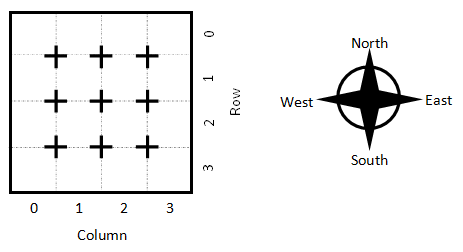

# The Fountain of Objects

The *Fountain of Objects* game is a 2D grid-based world full of rooms. Most rooms are empty, but a few are unique rooms. One room is the cavern entrance. Another is the fountain room, containing the Fountain of Objects.

The player moves through the cavern system one room at a time to find the Fountain of Objects. They activate it and then return to the entrance room. If they do this without falling into a pit, they win the game.

Unnatural darkness pervades the caverns, preventing both natural and human-make light. They player must navigate the caverns in the dark, relying on their sense of smell and hearing to determine what room they are in and what dangers lurk in nearby rooms.

This challenge serves as the basis for the other challenges in this level. It must be completed before the others can be started. The requirements of this game are listed below.

## Objectives

- The world consists of a grid of rooms, where each room can be referenced by its row and column. North is up, east is right, south is down, and west is left.

    

- The game's flow works like this: The player is told what they can sense in the dark (see, hear, smell). Then the player gets a chance to perform some action by typing it in. Their chosen action is resolved (the player moves, state of things in the game changes, checking for a win or a loss, etc.). Then the loop repeats.
- Most rooms are empty rooms, and there is nothing to sense.
- The player is in one of the rooms and can move between them by typing commands like the following: "move north", "move south", "move east", and "move west". The player should not be able to move past the end of the map.
- The room at (Row=0, Column=0) is the cavern entrance (and exit). The player should start here. The player can sense light coming from outside the cavern when in this room. ("You see light in this room coming from outside the cavern. This is the entrance.")
- The room at (Row=0, Column=2) is the fountain room, containing the Fountain of Objects itself. The Fountain can be either enabled or disabled. The player can hear the fountain but hears different things depending on if it is on or not. ("You hear water dripping in this room. The Fountain of Objects is here!" or "You hear the rushing waters from the Fountain of Objects. it has been reactivated!"). The fountain is off initially. In the fountain room, the player can type "enable fountain" to enable it. If the player is not in the fountain room and runs this, there should be no effect, and the player should be told so.
- The player wins by moving to the fountain room, enabling the Fountain of Objects, and moving back to the cavern entrance. If the player is in the entrance and the fountain is on, the player wins.
- Use different colours to display the different types of text in the console window. For example, narrative items (intro, ending, etc.) may be magenta, descriptive text in white, input from the user in cyan, text describing entrance light in yellow, messages about the fountain in blue.
- An example of what the program might look like is shown below:

````none
-------------------------------------------------------------------------------------
You are in the room at (Row=0, Column=0).
You see light coming from the cavern entrance.
What do you want to do? move east
-------------------------------------------------------------------------------------
You are in the room at (Row=0, Column=1).
What do you want to do? move east
-------------------------------------------------------------------------------------
You are in the room at (Row=0, Column=2).
You hear water dripping in this room. The Fountain of Objects is here!
What do you want to do? enable fountain
-------------------------------------------------------------------------------------
You are in the room at (Row=0, Column=2).
You hear the rushing waters from the Fountain of Objects. It has been reactivated!
What do you want to do? move west
-------------------------------------------------------------------------------------
You are in the room at (Row=0, Column=1)
What do you want to do? move west
-------------------------------------------------------------------------------------
You are in the room at (Row=0, Column=0).
The Fountain of Objects has been reactivated, and you have escaped with your life!
You win!
````

- **Hint**: You may find two-dimensional arrays (Level 12) helpful in representing a 2D grid-based game world.
- **Hint**: Remember your training! You do not need to solve this entire problem all at once, and you do not have to get it right in your first attempt. Pick an item or two to start and solve just those items. Rework until you are happy with it, then add the next item or two.
